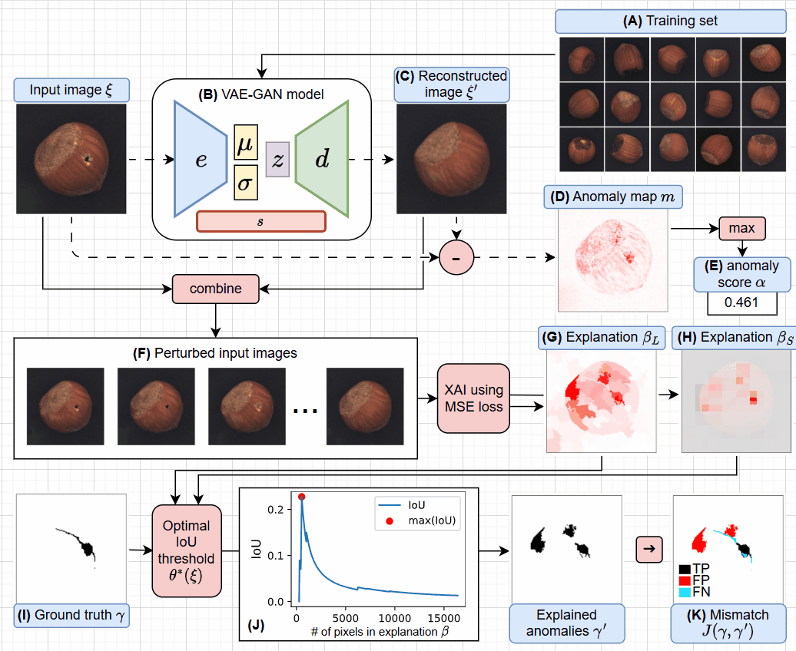

<!-- # Muhammad Rashid -->

Machine Learning Researcher specializing in **Explainable AI (XAI)**, **Computer Vision**, and **Visual Anomaly Detection** for real-world and safety-critical systems.

## Research Focus

- Explainable AI for trustworthy decision-making
- Visual anomaly detection in industrial and robotic environments
- Pixel-level feature attribution using Shapley-based methods
- Robust and efficient explanation methods for computer vision

📌 **AAAI 2026**: _ShapBPT — Image Feature Attribution using Data-Aware Binary Partition Trees_

📌 **ICPE 2026 / QualITA Workshop**: _ShapBPT in Perspective: A Consolidated Review and an eXplainable Anomaly Detection Case Study_

## Systems & Engineering

- Real-time anomaly detection for robotics safety
- ROS2-based live inference pipeline
- VAE / VAE-GAN models for industrial anomaly detection
- Multi-camera monitoring and safety-area segmentation
- End-to-end workflow: training → threshold calibration → live deployment

**Achieved:**

- ~12 FPS real-time inference
- ~99.6% detection accuracy in industrial scenarios
- Explainable anomaly maps for safety-critical decision support

## Open Source & Tools

- **ShapBPT** — AAAI 2026 explainability framework
- **XAD** — Explainable anomaly detection with ShapBPT
- **LIME Stratified Sampling** — Improved explanation stability
- **AI on Edge Devices** — Lightweight deployment pipelines
- XAI evaluation tools for saliency, attribution, and benchmarking

<!-- =========================================================
     SELECTED PUBLICATIONS
     ========================================================= -->

<h2>Selected Publications</h2>

<!-- =====================================================
     ShapBPT — AAAI 2026
     ===================================================== -->

AAAI 2026

<h3>
<a href="/publication/p12_shapbpt/">
ShapBPT: Image Feature Attribution using Data-Aware Binary Partition Trees
</a>
</h3>

<a
href="https://ojs.aaai.org/index.php/AAAI/article/view/39699"
class="custom-btn btn-paper"
target="_blank"
rel="noopener noreferrer">
Paper PDF
</a>

<a
href="https://www.arxiv.org/abs/2602.07047"
class="custom-btn btn-arxiv"
target="_blank"
rel="noopener noreferrer">
arXiv
</a>

<a
href="https://github.com/amparore/shap_bpt"
class="custom-btn btn-code"
target="_blank"
rel="noopener noreferrer">
Code
</a>

<a
href="https://github.com/rashidrao-pk/shap_bpt_tests"
class="custom-btn btn-tests"
target="_blank"
rel="noopener noreferrer">
Tests
</a>

<a
href="https://pypi.org/project/shap-bpt/"
class="custom-btn btn-pypi"
target="_blank"
rel="noopener noreferrer">
PyPI
</a>

<a
href="https://shapbpt.readthedocs.io/en/latest/"
class="custom-btn btn-docs"
target="_blank"
rel="noopener noreferrer">
Docs
</a>

<a
href="https://huggingface.co/spaces/rashidrao/shapbpt-user-study"
class="custom-btn btn-demo"
target="_blank"
rel="noopener noreferrer">
User Study
</a>

<a
href="https://underline.io/lecture/141841-shapbpt-image-feature-attributions-using-data-aware-binary-partition-trees"
class="custom-btn btn-poster"
target="_blank"
rel="noopener noreferrer">
Poster
</a>

<!-- =====================================================
     ShapBPT in Perspective — ICPE / QualITA 2026
     ===================================================== -->

ICPE 2026 · QualITA

<h3>
<a href="/publication/p13_ShapBPT_AD/">
ShapBPT in Perspective: A Consolidated Review and an eXplainable Anomaly Detection Case Study
</a>
</h3>

<a
href="https://dl.acm.org/doi/10.1145/3777911.3800638"
class="custom-btn btn-paper"
target="_blank"
rel="noopener noreferrer">
Paper PDF
</a>

<a
href="https://github.com/rashidrao-pk/XAD"
class="custom-btn btn-code"
target="_blank"
rel="noopener noreferrer">
Code
</a>

<!-- =====================================================
     LIME Stratified — AAAI 2024
     ===================================================== -->

AAAI 2024

<h3>
<a href="/publication/p9_lime_stratified/">
Using Stratified Sampling to Improve LIME Image Explanations
</a>
</h3>

<a
href="https://ojs.aaai.org/index.php/AAAI/article/view/29397"
class="custom-btn btn-paper"
target="_blank"
rel="noopener noreferrer">
Paper PDF
</a>

<a
href="https://arxiv.org/abs/2403.17742"
class="custom-btn btn-arxiv"
target="_blank"
rel="noopener noreferrer">
arXiv
</a>

<a
href="https://github.com/rashidrao-pk/lime_stratified"
class="custom-btn btn-code"
target="_blank"
rel="noopener noreferrer">
Code
</a>

<a
href="https://github.com/rashidrao-pk/lime-stratified-examples"
class="custom-btn btn-tests"
target="_blank"
rel="noopener noreferrer">
Tests
</a>

<a
href="https://pypi.org/project/lime-stratified/"
class="custom-btn btn-pypi"
target="_blank"
rel="noopener noreferrer">
PyPI
</a>

<a
href="/files/papers_data/lime/Poster_St_LIME_AAAI_24.pdf"
class="custom-btn btn-tests"
target="_blank"
rel="noopener noreferrer">
Poster
</a>

<a
href="/files/papers_data/lime/st_lime_slides.pdf"
class="custom-btn btn-slides"
target="_blank"
rel="noopener noreferrer">
Slides
</a>

<!-- =====================================================
     Explainable Anomaly Detection — XAI World 2024
     ===================================================== -->

XAI World 2024

<h3>
<a href="/publication/p10_anomaly_detection_xai/">
Can I Trust My Anomaly Detection System?
</a>
</h3>

<!-- codeurl: "https://github.com/rashidrao-pk/anomaly_detection_trust_case_study" -->

<a
href="https://link.springer.com/chapter/10.1007/978-3-031-63803-9_13"
class="custom-btn btn-arxiv"
target="_blank"
rel="noopener noreferrer">
Paper PDF
</a>

<a
href="https://arxiv.org/abs/2407.19951"
class="custom-btn btn-arxiv"
target="_blank"
rel="noopener noreferrer">
arXiv
</a>

<a
href="https://github.com/rashidrao-pk/anomaly_detection_trust_case_study"
class="custom-btn btn-code"
target="_blank"
rel="noopener noreferrer">
Code
</a>

<a
href="https://rashidrao-pk.github.io/files/papers_data/XAD/anomaly_detection_xai_w_slides.pdf"
class="custom-btn btn-code"
target="_blank"
rel="noopener noreferrer">
Slides
</a>

<a href="/publications/">➡️ See full publication list</a>

<!-- =========================================================
     FEATURED PROJECTS
     ========================================================= -->

<h2>Featured Projects</h2>

<!-- Real-Time Anomaly Detection for Robotics -->

Industrial AI · Robotics Safety

<h3>
<a href="/projects/advis-distrimuse-sr/">
Real-Time Anomaly Detection for Robotics
</a>
</h3>

Industrial safety monitoring system with multi-area anomaly detection,
ROS2-based live inference, and visual anomaly maps for decision interpretation.

<a href="/projects/advis-distrimuse-sr/"
class="custom-btn btn-paper">
Project Page
</a>

<a href="https://github.com/rashidrao-pk/advis_distrimuse_unito_SR"
class="custom-btn btn-code"
target="_blank"
rel="noopener noreferrer">
Code
</a>

<!-- =====================================================
     ADVIS-UniGra
     ===================================================== -->

EU Project · Industrial AI

<h3>
<a href="/projects/advis-unigra/">
ADVIS-UniGra: RGB Anomaly Detection for Safe Human–Robot Collaboration
</a>
</h3>

RGB-based anomaly detection for collaborative robotics using safety-area
monitoring, area-specific VAE-GAN models, threshold calibration, and
explainable anomaly maps.

<a href="/projects/advis-unigra/"
class="custom-btn btn-paper">
Project Page
</a>

<a href="https://github.com/rashidrao-pk/advis_distrimuse_unito"
class="custom-btn btn-code"
target="_blank"
rel="noopener noreferrer">
Code
</a>

<a href="https://zenodo.org/records/18742241"
class="custom-btn btn-dataset"
target="_blank"
rel="noopener noreferrer">
Dataset
</a>

<!-- ShapBPT -->

Explainable AI · AAAI 2026

<h3>
<a href="/projects/shap-bpt/">
ShapBPT
</a>
</h3>

Hierarchical image explanation method using data-aware Binary Partition Trees
and Shapley-based feature attribution.

<a href="https://ojs.aaai.org/index.php/AAAI/article/view/39699"
class="custom-btn btn-paper"
target="_blank"
rel="noopener noreferrer">
Paper PDF
</a>

<a href="https://www.arxiv.org/abs/2602.07047"
class="custom-btn btn-arxiv"
target="_blank"
rel="noopener noreferrer">
arXiv
</a>

<a href="https://github.com/amparore/shap_bpt"
class="custom-btn btn-code"
target="_blank"
rel="noopener noreferrer">
Code
</a>

<a href="https://pypi.org/project/shap-bpt/"
class="custom-btn btn-pypi"
target="_blank"
rel="noopener noreferrer">
PyPI
</a>

<a href="https://shapbpt.readthedocs.io/en/latest/"
class="custom-btn btn-docs"
target="_blank"
rel="noopener noreferrer">
Docs
</a>

<!-- XAD -->

Explainable Anomaly Detection

<h3>
<a href="/projects/explainable-anomaly-detection/">
XAD: Explainable Anomaly Detection
</a>
</h3>

Explainable anomaly detection framework that applies ShapBPT to help identify
why an image or image region is considered anomalous.

<a href="/projects/explainable-anomaly-detection/"
class="custom-btn btn-paper">
Project Page
</a>

<a href="https://github.com/rashidrao-pk/XAD"
class="custom-btn btn-code"
target="_blank"
rel="noopener noreferrer">
Code
</a>

<!-- LIME Stratified Sampling -->

Explainable AI · LIME

<h3>
<a href="/projects/lime-stratified-sampling/">
LIME Stratified Sampling
</a>
</h3>

Improves the stability of LIME image explanations through stratified
perturbation sampling, reducing variance and improving explanation reliability.

<a href="/projects/lime-stratified-sampling/"
class="custom-btn btn-paper">
Project Page
</a>

<a href="https://github.com/rashidrao-pk/lime_stratified"
class="custom-btn btn-code"
target="_blank"
rel="noopener noreferrer">
Code
</a>

<a href="https://pypi.org/project/lime-stratified/"
class="custom-btn btn-pypi"
target="_blank"
rel="noopener noreferrer">
PyPI
</a>

<a href="/projects/">➡️ View all projects</a>

<!-- =========================================================
     EXPERIENCE
     ========================================================= -->

## Experience

- 🎓 PhD Researcher — University of Turin, Italy ([details here](https://rashidrao-pk.github.io/cv/#:~:text=Doctoral%20Researcher%20%E2%80%93%20R%26D%20Projects))
- 🏭 Industrial Research — RuleX Innovation Labs
- 🇪🇺 EU Project — DistriMuSe: Robotics Safety & AI
- 🌐 Visiting Researcher — University of Granada, Spain ([details here](https://rashidrao-pk.github.io/cv/#:~:text=Visiting%20Doctoral%20Researcher))

<!-- =========================================================
     PYTHON PACKAGES
     ========================================================= -->

## Published Python Packages

Python packages released for explainable AI and reproducible research.

| Package             | Focus                                  | Registry | Version                                                              | Links                                                                                                       |
| ------------------- | -------------------------------------- | -------- | -------------------------------------------------------------------- | ----------------------------------------------------------------------------------------------------------- |
| **lime-stratified** | Stable LIME image explanations         | PyPI     | ... | [PyPI](https://pypi.org/project/lime-stratified/) · [Code](https://github.com/rashidrao-pk/lime_stratified) |
| **shap-bpt**        | Hierarchical Shapley image attribution | PyPI     | ...        | [PyPI](https://pypi.org/project/shap-bpt/) · [Docs](https://shapbpt.readthedocs.io/en/latest/)              |

➡️ [View all Python packages](/packages/)

<!-- =========================================================
     OPEN SOURCE CONTRIBUTIONS
     ========================================================= -->

## Open Source Contributions

Selected contributions to open-source machine learning, anomaly detection, and data science software.

<table>
<thead>
<tr>
<th>Library</th>
<th>Organization</th>
<th>Focus</th>
<th>Stars</th>
<th>Contribution</th>
</tr>
</thead>

<tbody>

<tr>
<td>
<a href="https://github.com/deel-ai/xplique">Xplique</a>
</td>
<td>DEEL</td>
<td>Explainable AI</td>
<td>
Loading...
</td>
<td>
<a href="https://github.com/deel-ai/xplique/pull/184">
Tabular plot colorbar fix
</a>
</td>
</tr>

<tr>
<td>
<a href="https://github.com/open-edge-platform/anomalib">Anomalib</a>
</td>
<td>
<a href="https://www.intel.com/content/www/us/en/developer/topic-technology/open/project-catalog.html">
Intel/Open Edge Platform
</a>
</td>
<td>Visual Anomaly Detection</td>
<td>
Loading...
</td>
<td>
<a href="https://github.com/open-edge-platform/anomalib/pull/3630">
PatchCore docs
</a>
</td>
</tr>

<tr>
<td>
<a href="https://github.com/microsoft/FLAML">FLAML</a>
</td>
<td>Microsoft</td>
<td>AutoML / ML Systems</td>
<td>
Loading...
</td>
<td>
<a href="https://github.com/microsoft/FLAML/issues/413">
Anomaly detection support
</a>
</td>
</tr>

<tr>
<td>
<a href="https://github.com/Data-Centric-AI-Community/awesome-python-for-data-science">
Awesome Python for Data Science
</a>
</td>
<td>Data-Centric AI Community</td>
<td>Data Science Education</td>
<td>

Loading...

</td>
<td>
<a href="https://github.com/Data-Centric-AI-Community/awesome-python-for-data-science/pull/42">
Anomaly detection tutorial
</a>
</td>
</tr>

</tbody>
</table>

➡️ [View all open-source contributions](/opensource/)

<!-- =========================================================
     GITHUB ACTIVITY
     ========================================================= -->

## GitHub Activity

<a href="https://github.com/rashidrao-pk">
View my GitHub profile
</a>

<!-- =========================================================
     COLLABORATION
     ========================================================= -->

## Collaboration

I’m interested in collaborations on:

- Explainable AI and trustworthy machine learning
- Visual anomaly detection
- Industrial AI and robotics safety
- Computer vision for real-world systems
- Vision-language models and explainability

<!-- =========================================================
     CONTACT
     ========================================================= -->

## Contact

- 📧 Email: `{FIRSTNAME}.{LASTNAME}@unito.it`
- 🔗 GitHub: [github.com/rashidrao-pk](https://github.com/rashidrao-pk)
- 📚 Google Scholar: [Muhammad Rashid](https://scholar.google.com.pk/citations?user=F5u_Z5MAAAAJ)

<!-- =========================================================
     DYNAMIC GITHUB + PYPI DATA
     ========================================================= -->

