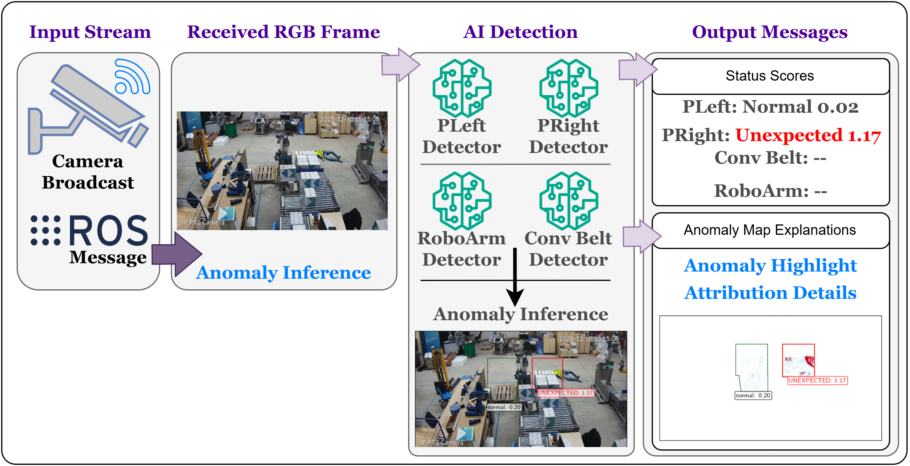

## EU Project: DistriMuSe — Safe Interaction with Robots

🔗 [https://distrimuse.eu/](https://distrimuse.eu/)

Contributed to the **Safe Interaction with Robots** use case of the European industrial project **DistriMuSe**, focusing on **explainable anomaly detection for industrial robotics**.

- **Contributions**
  - Developed a **zoned VAE–GAN anomaly detection framework** for localized and interpretable monitoring.
  - Introduced a **robust threshold calibration strategy** across **53 anomaly scoring methods**.
- **Achievements**
  - **99.61% accuracy**, **95.1% recall**, **90.9% F1-score**
  - **Real-time inference** at ~**12.5 FPS**
- **Skills Earned**
  - Tools: Generative AI, Python, PyTorch, VAE–GANs, CNNs, latent space, anomaly detection, one class classification.
  - Communication Protocols: Zenoh, ROS2, Rest-api.
  - Management: Presentations, team managment, collaborations among EU countries.

---

## Improvements in Coalition genertion for Shapley Values Generation
🔗 [https://github.com/rashidrao-pk/shap_bpt_tests](https://github.com/rashidrao-pk/shap_bpt_tests)

Research project focused on improving the **Shapley Values Generation using Data Aware Binary Partition Trees**, imporved object localization using XAI methods.

- **Tools & Methods**: Python, Pytorch, CNNs, ViTs, Explainable AI (Shap), CAM XAI methods.

## Improvements in Sampling Strategy for LIME Image Explanations
🔗 [https://github.com/rashidrao-pk/lime_stratified](https://github.com/rashidrao-pk/lime_stratified)

Research project focused on improving the **sampling strategy of LIME for image explanations**, enhancing stability and faithfulness of explanations for deep vision models.

- **Tools & Methods**: Python, TensorFlow, CNNs, Explainable AI (LIME)

---

## Explainable Anomaly Detection — Trust Case Study
🔗 [https://github.com/rashidrao-pk/anomaly_detection_trust_case_study](https://github.com/rashidrao-pk/anomaly_detection_trust_case_study)

A comprehensive study on **trust and interpretability in anomaly detection systems**, combining generative models with explanation techniques to support human decision-making.

- **Tools & Methods**: Generative AI, Python, TensorFlow, VAE–GANs, CNNs

---

## AI Deployment on Edge Devices
🔗 [https://github.com/rashidrao-pk/AI_on_Edge_Devices](https://github.com/rashidrao-pk/AI_on_Edge_Devices)

Research and implementation of **lightweight deep learning models** for deployment on **resource-constrained edge devices**.

- **Tools & Methods**: CNNs, Model Quantization, TensorFlow, Raspberry Pi

---

## Previously Developed Freelance Research Projects (2017-2022) 🏭

As a freelancer, **applied Computer Vision and Machine Learning projects** developed through international freelance collaborations with academic and industrial clients. The work mainly covers **medical image analysis** (detection, segmentation, and classification from MRI, CT, fundus, and dermoscopic images) and **classical as well as deep learning–based vision pipelines**, including feature matching, image stitching, fusion, enhancement, and denoising.

Several projects also address **intelligent decision systems** using neural networks, ensemble learning, evolutionary algorithms, and graph-based models. Implemented primarily in **MATLAB and Python**, many solutions were delivered as **end-to-end systems with graphical user interfaces (GUIs)**, emphasizing practical deployment, interpretability, and real-world applicability in healthcare, automation, and safety-critical scenarios. Further details about projects are given on the [**_THIS GITHUB REPO_**](https://github.com/rashidrao-pk/r4sshd/tree/main/project_completed). Here are few of examples what clients said about me? can be found at [**_This Link_**](https://github.com/rashidrao-pk/rashidrao-pk/blob/main/project_completed/feedbacks.md)

Some of these contributions are publicly available as **open-source resources** on the [**MathWorks File Exchange**](https://ch.mathworks.com/matlabcentral/fileexchange/113080-classification-of-gastrointestinal-diseases-of-stomach?s_tid=prof_contriblnk). Below is a brief summary of selected completed projects.
