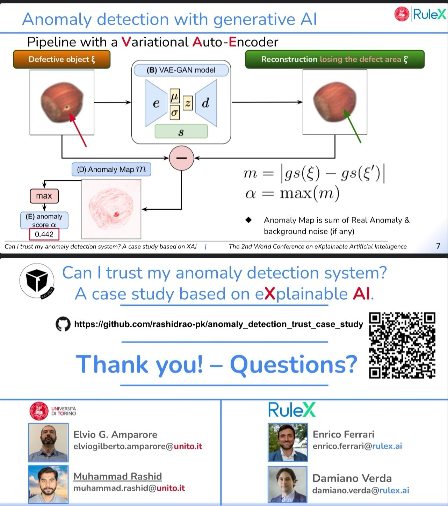

Generative models based on variational autoencoders are a popular technique for detecting anomalies in images in a semi-supervised context. A common approach employs the anomaly score to detect the presence of anomalies, and it is known to reach high level of accuracy on benchmark datasets. However, since anomaly scores are computed from reconstruction disparities, they often obscure the detection of various spurious features, raising concerns regarding their actual efficacy. 
This case study explores the robustness of an anomaly detection system based on variational autoencoder generative models through the use of eXplainable AI methods. The goal is to get a different perspective on the real performances of anomaly detectors that use reconstruction differences. In our case study we discovered that, in many cases, samples are detected as anomalous for the wrong or misleading factors. 


*   Special Session: **_Explainable AI_** for improved **_human-computer interaction_**
*   Conference: **_xAI-2024_** | Explainable Artificial Intelligence
*   Link to talk:   [**_https://xaiworldconference.com/2024/timetable/event/s-17-a-1_**](https://xaiworldconference.com/2024/timetable/event/s-17-a-1)

Contributions 📃
===
In this research, we:

1. *Review an explainable Anomaly Detection system architecture that combines VAE-GAN
models with the LIME and SHAP explanation methods;*
2. *Quantify the capacity of the Anomaly Detection system in performing anomaly detection
using anomaly scores;*
3. *Use XAI methods to determine if anomalies are actually detected for the
right reason by comparing with a ground truth. Results show that it is not
uncommon to find samples that were classified as anomalous, but for the
wrong reason. We adopt a methodology based on optimal Jaccard score to
detect such samples.*

Method Availability
===
*   The method is available under: [https://github.com/rashidrao-pk/**anomaly_detection_trust_case_study**](https://github.com/rashidrao-pk/anomaly_detection_trust_case_study)
*   Links: [GitHub](https://github.com/rashidrao-pk/anomaly_detection_trust_case_study) [Paper PDF on **_Arxiv_**](https://arxiv.org/abs/2407.19951) [Proceedings of **_XAI_**](https://link.springer.com/chapter/10.1007/978-3-031-63803-9_13), [**_Download Slides_**](https://rashidrao-pk.github.io/files/anomaly_detection_xai_w_slides.pdf) 


Workflow
===
<center>
 </center>


---

Authors ✍️
===
| Sr. No. | Author Name | Affiliation | Google Scholar | 
| :--:    | :--:        | :--:        | :--:           | 
| 1. | Muhammad Rashid | University of Torino, Computer Science Department, C.so Svizzera 185, 10149 Torino, Italy | [Muhammad Rashid](https://scholar.google.com/citations?user=F5u_Z5MAAAAJ&hl=en) | 
| 2. | Elvio G. Amparore | University of Torino, Computer Science Department, C.so Svizzera 185, 10149 Torino, Italy | [Elvio G. Amparore](https://scholar.google.com/citations?user=Hivlp1kAAAAJ&hl=en&oi=ao) | 
| 3. | Enrico Ferrari | Rulex Innovation Labs, Rulex Inc., Via Felice Romani 9, 16122 Genova, Italy | [Enrico Ferrari](https://scholar.google.com/citations?user=QOflGNIAAAAJ&hl=en&oi=ao) | 
| 4. | Damiano Verda | Rulex Innovation Labs, Rulex Inc., Via Felice Romani 9, 16122 Genova, Italy | [Damiano Verda](https://scholar.google.com/citations?user=t6o9YSsAAAAJ&hl=en&oi=ao) |

Keywords 🔍
===
Anomaly detection · variational autoencoder · eXplainable
AI

Citation
===
```
@InProceedings{10.1007/978-3-031-63803-9_13, author="Rashid, Muhammad and Amparore, Elvio and Ferrari, Enrico and Verda, Damiano", editor="Longo, Luca and Lapuschkin, Sebastian and Seifert, Christin", title="Can I Trust My Anomaly Detection System? A Case Study Based on Explainable AI", booktitle="Explainable Artificial Intelligence",
year="2024", publisher="Springer Nature Switzerland",
address="Cham", pages="243--254"}
```


