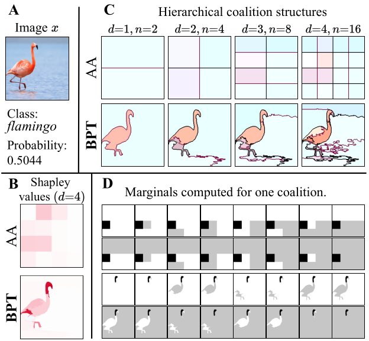
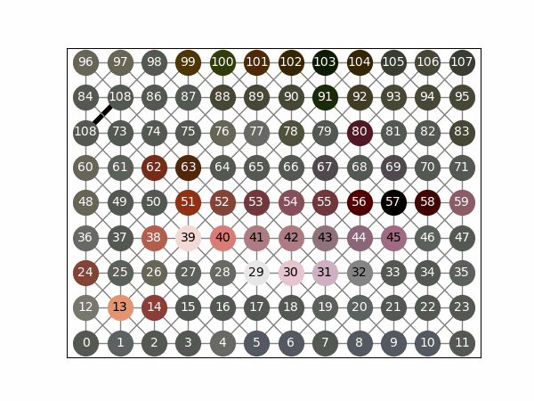
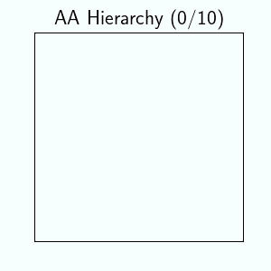
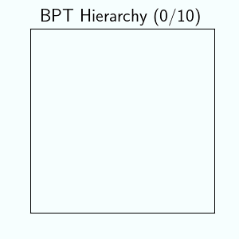
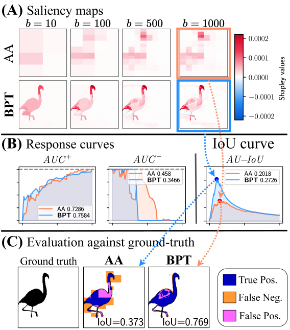
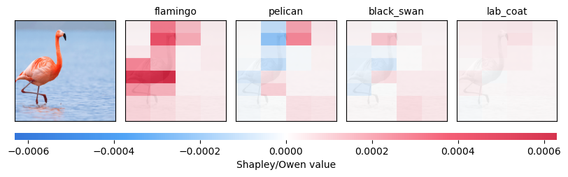
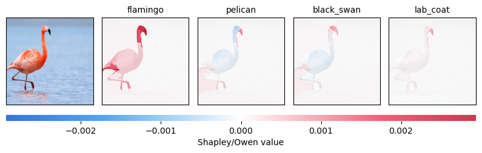

Pixel-level **_feature attributions_** play a key role in **_Explainable Computer Vision (XCV)_** by revealing how visual features influence model predictions. While hierarchical **_Shapley_** methods based on the **_Owen formula_** offer a principled explanation framework, existing approaches overlook the multiscale and morphological structure of images, resulting in inefficient computation and weak semantic alignment.

To bridge this gap, we introduce **_ShapBPT_**, a data-aware **_XCV_** method that integrates hierarchical Shapley values with a **_Binary Partition Tree (BPT)_** representation of images. By assigning Shapley coefficients directly to a multiscale, image-adaptive hierarchy, ShapBPT produces explanations that align naturally with intrinsic image structures while significantly reducing computational cost. Experimental results demonstrate improved efficiency and structural faithfulness compared to existing XCV methods, and a **_20-subject user study_** confirms that ShapBPT explanations are consistently preferred by humans.

*   Main Technical Track: **_ShapBPT_** for improved **Image Feature Attributions using Binary Partition Trees**
*   The method is available under: [https://github.com/amparore/**shap_bpt**](https://github.com/amparore/shap_bpt).
*   Conference: **_AAAI-2026_** (40th Annual AAAI Conference on Artificial Intelligence)
*   Link to talk:   [**_https://aaai.org/wp-content/uploads/2026/01/Main-track-poster-presentations-1.pdf_**](https://aaai.org/wp-content/uploads/2026/01/Main-track-poster-presentations-1.pdf)
*   Python Package: [https://pypi.org/project/shap-bpt/](https://pypi.org/project/shap-bpt/) - **`pip install shap-bpt`**
*   **_Poster in PDF_**: [**_https://rashidrao-pk.github.io/files/AAAI_26_poster.pdf_**](https://rashidrao-pk.github.io/files/AAAI_26_poster.pdf)
*   [PDF on ArXiv](https://www.arxiv.org/abs/2602.07047),  [**_Technical Appendix_**](https://zenodo.org/records/17570695).
*   [https://github.com/rashidrao-pk/**shap_bpt_tests**](https://github.com/rashidrao-pk/shap_bpt_tests)

Contributions 📃
===
In this research, we introduces;

1.  A novel hierarchical model-agnostic XCV method for images, named \emph{ShapBPT}, that integrates an adaptive multi-scale partitioning algorithm with the Owen approximation of the Shapley coefficients. We repurpose the BPT (Binary Partition Tree) algorithm~\cite{salembier2000BPT} to effectively construct hierarchical structures for explainability. This approach overcomes the limitations of the inflexible hierarchies of state-of-the-art methods such as SHAP.
2.  An empirical assessment of the proposed method on natural color images showcasing its efficacy across various scoring targets, in comparison to established state-of-the-art XCV methods, and a controlled human-subject study comparing explanation interpretability across methods.
3. Open source code and Python package. (shap-bpt)

How it Works?
===

 
<hr>
 
  
<hr>
 
<hr>

<hr>

<hr>

Datasets and Models
===

*   **Dataset**:    ImageNet, MC Coco, MVTec, CelebA-HQ.
*   **Model**:      ViT, SwinViT, ResNet-50, Yolo-v11, Custom CNN, VAE-GAN.

Experiments Summary
===


| ID | Dataset | Size | Model | Short Description |
|:--:|:--------|:----:|:------|:------------------|
| E1 | ImageNet-S<sub>50</sub> | 574 | ResNet50 | Common ImageNet setup |
| E2 | ImageNet-S<sub>50</sub> | 574 | Ideal | Linear ideal model |
| E3 | ImageNet-S<sub>50</sub> | 621 | SwinViT | Vision Transformer |
| E4 | MS-COCO | 274 | YOLO11s | Object detection |
| E5 | CelebA | 400 | CNN | Facial attribute localization |
| E6 | MVTec | 280 | VAE-GAN | Anomaly Detection |
| E7 | ImageNet-S<sub>50</sub> | 593 | ViT-Base16 | Vision Transformer |
| E8 | — | — | — | User preference study using E1 saliency maps |


---

Authors ✍️
===

| Sr. No. | Author Name | Affiliation | Google Scholar | 
| :--:    | :--:        | :--:        | :--:           | 
| 1. | Muhammad Rashid | University of Torino, Dept. of Computer Science, Torino, Italy | [Muhammad Rashid](https://scholar.google.com/citations?user=F5u_Z5MAAAAJ&hl=en) | 
| 2. | Elvio G. Amparore | University of Torino, Dept. of Computer Science, Torino, Italy | [Elvio G. Amparore](https://scholar.google.com/citations?user=Hivlp1kAAAAJ&hl=en&oi=ao) | 
| 3. | Enrico Ferrari | Rulex Innovation Labs, Rulex Inc., Genova, Italy | [Enrico Ferrari](https://scholar.google.com/citations?user=QOflGNIAAAAJ&hl=en&oi=ao) | 
| 4. | Damiano Verda | Rulex Innovation Labs, Rulex Inc., Genova, Italy | [Damiano Verda](https://scholar.google.com/citations?user=t6o9YSsAAAAJ&hl=en&oi=ao) |

Keywords 🔍
===
Shapley Values · Binary Partition Trees · eXplainable
AI · XAI · Image Feature Attributions

<!-- Citation
===
```bash
@InProceedings{10.1007/978-3-031-63803-9_13, author="Rashid, Muhammad and Amparore, Elvio and Ferrari, Enrico and Verda, Damiano", editor="Longo, Luca and Lapuschkin, Sebastian and Seifert, Christin", title="Can I Trust My Anomaly Detection System? A Case Study Based on Explainable AI", booktitle="Explainable Artificial Intelligence",
year="2024", publisher="Springer Nature Switzerland",
address="Cham", pages="243--254"}
``` -->


