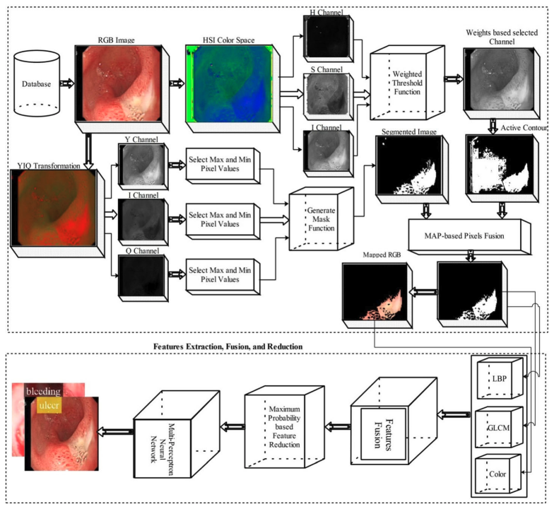

**Authors:**  
Muhammad Attique Khan, **Muhammad Rashid**, Muhammad Sharif, Kashif Javed, Tallha Akram

---

This work presents a framework for **classification of gastrointestinal diseases** from **wireless capsule endoscopy (WCE) images** using an improved **saliency-based segmentation approach** combined with **discriminant feature selection**. The method enhances classification performance by focusing on relevant regions and selecting the most informative features.

 

---

## Contributions 📃

1. A framework for automated **GI disease classification** using WCE images.  
2. Improved **saliency-based segmentation** for extracting relevant regions.  
3. Use of **discriminant feature selection** to enhance classification performance.  
4. Evaluation on medical image datasets with improved classification accuracy.

---

## 📖 Citation (BibTeX)

  <button class="copy-bibtex-btn" onclick="copyBibtex(this)">Copy BibTeX</button>

<pre><code class="language-bibtex">@article{khan2019classification,
  title     = {Classification of Gastrointestinal Diseases of Stomach from WCE Using Improved Saliency-Based Method and Discriminant Feature Selection},
  author    = {Khan, Muhammad Attique and Rashid, Muhammad and Sharif, Muhammad and Javed, Kashif and Akram, Tallha},
  journal   = {Multimedia Tools and Applications},
  year      = {2019},
  publisher = {Springer},
  doi       = {10.1007/s11042-019-07875-9}
}</code></pre>

