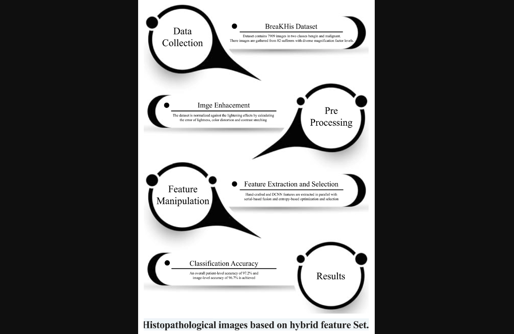

**Authors:**  
Inzamam M. N., <u>Muhammad Rashid</u>, J. H. Shah, M. Sharif, M. Yahiya H. A., Monagi H. A.

---

This work proposes an optimized framework for **breast cancer classification** using histopathological images by combining **hybrid feature extraction techniques**. The approach integrates multiple feature representations to improve classification accuracy and robustness in medical image analysis.

 

---

<h2>📖 Citation (BibTeX)</h2>

  <button class="copy-bibtex-btn" onclick="copyBibtex(this)">Copy BibTeX</button>

<pre><code class="language-bibtex">@article{nasir2021optimized,
  title     = {An Optimized Approach for Breast Cancer Classification for Histopathological Images Based on Hybrid Feature Set},
  author    = {Nasir, Inzamam M. and Rashid, Muhammad and Shah, Jamal Hussain and Sharif, Muhammad and Awan, Muhammad Y. H. and Alkinani, Monagi H.},
  journal   = {Current Medical Imaging Reviews},
  volume    = {17},
  number    = {1},
  pages     = {136--147},
  year      = {2021},
  publisher = {Bentham Science Publishers}
}</code></pre>

