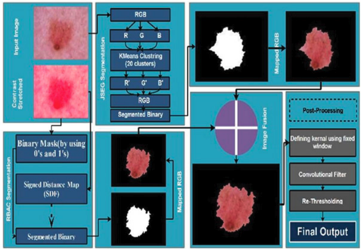

**Authors:**  
Rabia Javed, Mohd Shafry Mohd Rahim, Tanzila Saba, **Muhammad Rashid**

---

This work presents a **skin lesion segmentation framework** based on the fusion of **region-based active contour models** and **JSEG segmentation techniques**. The proposed approach improves segmentation accuracy by combining region homogeneity with boundary-based refinement, enabling better delineation of lesion structures in dermoscopic images.

 

---

## Contributions 📃

1. A hybrid segmentation framework combining **JSEG and active contour models**.
2. Improved boundary detection for complex skin lesion structures.
3. Robust segmentation performance on dermoscopic datasets.
4. Integration of region-based and edge-based segmentation strategies.

---

## 📖 Citation (BibTeX)

  <button class="copy-bibtex-btn" onclick="copyBibtex(this)">Copy BibTeX</button>

<pre><code class="language-bibtex">@article{javed2019region,
  title     = {Region-Based Active Contour JSEG Fusion Technique for Skin Lesion Segmentation from Dermoscopic Images},
  author    = {Javed, Rabia and Rahim, Mohd Shafry Mohd and Saba, Tanzila and Rashid, Muhammad},
  journal   = {Biomedical Research},
  volume    = {30},
  number    = {6},
  pages     = {1--10},
  year      = {2019}
}</code></pre>

