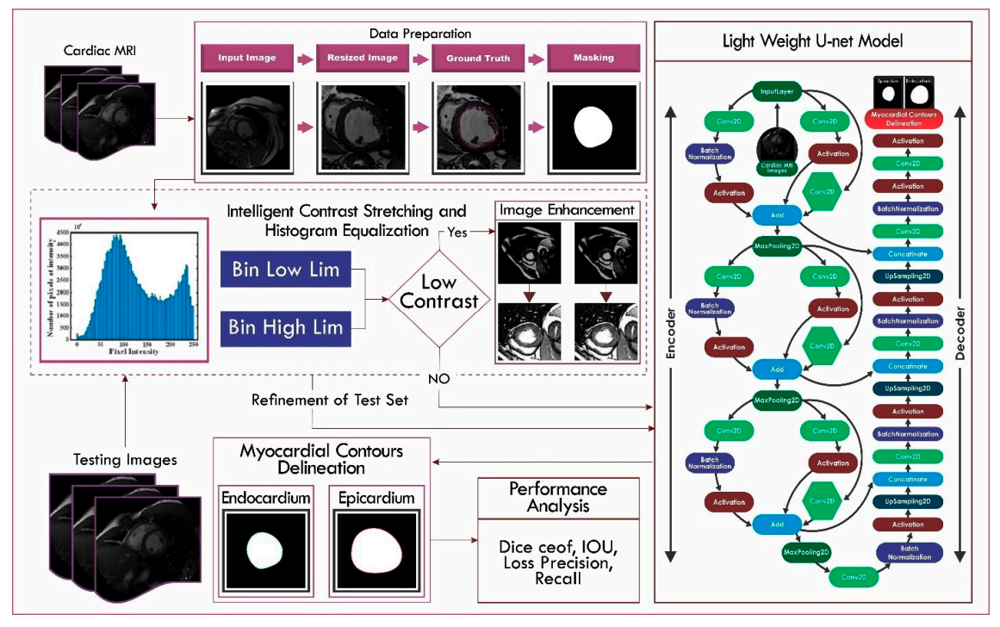

**Authors:**  
Mehreen Irshad, Mussarat Yasmin, Muhammad Imran Sharif, **Muhammad Rashid**, Muhammad Irfan Sharif, Seifedine Kadry

---

This work proposes a **lightweight U-Net architecture** for accurate **left ventricle segmentation** from **MRI images**. The model is designed to reduce computational complexity while maintaining high segmentation performance, making it suitable for efficient medical image analysis.

 

---

## Contributions 📃

1. A **lightweight U-Net model** for medical image segmentation.  
2. Improved segmentation accuracy for **left ventricle detection**.  
3. Reduced computational complexity compared to standard U-Net.  
4. Evaluation on MRI datasets demonstrating robust performance.

---

## 📖 Citation (BibTeX)

  <button class="copy-bibtex-btn" onclick="copyBibtex(this)">Copy BibTeX</button>

<pre><code class="language-bibtex">@article{irshad2023novel,
  title     = {A Novel Light U-Net Model for Left Ventricle Segmentation Using MRI},
  author    = {Irshad, Mehreen and Yasmin, Mussarat and Sharif, Muhammad Imran and Rashid, Muhammad and Sharif, Muhammad Irfan and Kadry, Seifedine},
  journal   = {Mathematics},
  volume    = {11},
  number    = {14},
  pages     = {3245},
  year      = {2023},
  publisher = {MDPI},
  doi       = {10.3390/math11143245}
}</code></pre>

