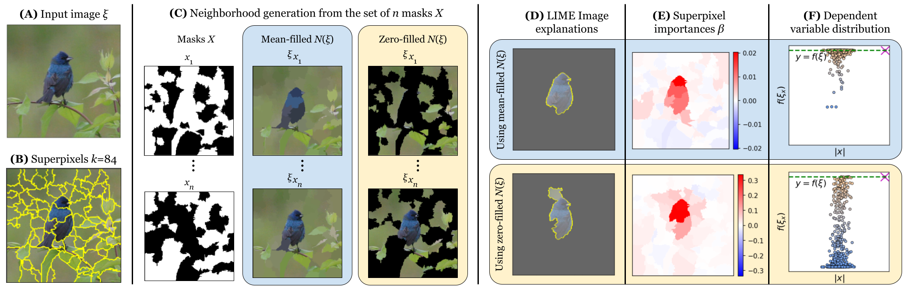

We investigate the use of a stratified sampling approach for LIME Image, a popular model-agnostic explainable AI method for computer vision tasks, in order to reduce the artifacts generated by typical Monte Carlo sampling. Such artifacts are due to the undersampling of the dependent variable in the synthetic neighborhood around the image being explained, which may result in inadequate explanations due to the impossibility of fitting a linear regressor on the sampled data. We then highlight a connection with the Shapley theory, where similar arguments about undersampling and sample relevance were suggested in the past. We derive all the formulas and adjustment factors required for an unbiased stratified sampling estimator. Experiments show the efficacy of the proposed approach.. 

Paper contribution
===

In this paper we:
- investigate the distribution of the dependent variable in
the sampled synthetic neighborhood of LIME Image,
identifying in the undersampling a cause that results in
inadequate explanations;
- delve into the causes of the synthetic neighborhood inad-
equacy, recognizing a link with the Shapley theory;
- reformulate the synthetic neighborhood generation using
an unbiased stratified sampling strategy;
- provide empirical proofs of the advantage of using strat-
ified sampling for LIME Image on a popular dataset.

Method Availability
===
*   The method is available under: [**https://github.com/rashidrao-pk/lime_stratified**](https://github.com/rashidrao-pk/lime_stratified) </a>
*   Examples and full results given at [**Lime_stratified_examples**](https://github.com/rashidrao-pk/lime-stratified-examples) 
*   Links: [**GitHub**](https://github.com/rashidrao-pk/lime_stratified), [Paper PDF on **_Arxiv_**](https://arxiv.org/abs/2403.17742)
[Proceedings of **_AAAI-24_**](https://ojs.aaai.org/index.php/AAAI/article/view/29397)


How LIME_Image Works
===



Keywords
===

XAI · LIME · Stratified Sampling . ML: Transparent, Interpretable, Explainable ML, RU: Stochastic Optimization, SO: Sampling/Simulation-based Search

Authors
===

| Sr. No. | Author Name | Affiliation | Google Scholar | 
| :--:    | :--:        | :--:        | :--:           | 
| 1. | Muhammad Rashid | University of Torino, Computer Science Department, C.so Svizzera 185, 10149 Torino, Italy | [Muhammad Rashid](https://scholar.google.com/citations?user=F5u_Z5MAAAAJ&hl=en) | 
| 2. | Elvio G. Amparore | University of Torino, Computer Science Department, C.so Svizzera 185, 10149 Torino, Italy | [Elvio G. Amparore](https://scholar.google.com/citations?user=Hivlp1kAAAAJ&hl=en&oi=ao) | 
| 3. | Enrico Ferrari | Rulex Innovation Labs, Rulex Inc., Via Felice Romani 9, 16122 Genova, Italy | [Enrico Ferrari](https://scholar.google.com/citations?user=QOflGNIAAAAJ&hl=en&oi=ao) | 
| 4. | Damiano Verda | Rulex Innovation Labs, Rulex Inc., Via Felice Romani 9, 16122 Genova, Italy | [Damiano Verda](https://scholar.google.com/citations?user=t6o9YSsAAAAJ&hl=en&oi=ao) |

Citation
===

If you use our proposed strategy, please cite us: <br>
``` 
Rashid, M., Amparore, E. G., Ferrari, E., & Verda, D. (2024). Using Stratified Sampling to Improve LIME Image Explanations. Proceedings of the AAAI Conference on Artificial Intelligence, 38(13), 14785-14792. https://doi.org/10.1609/aaai.v38i13.29397 
```
