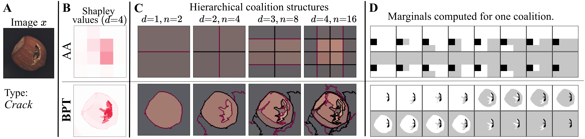
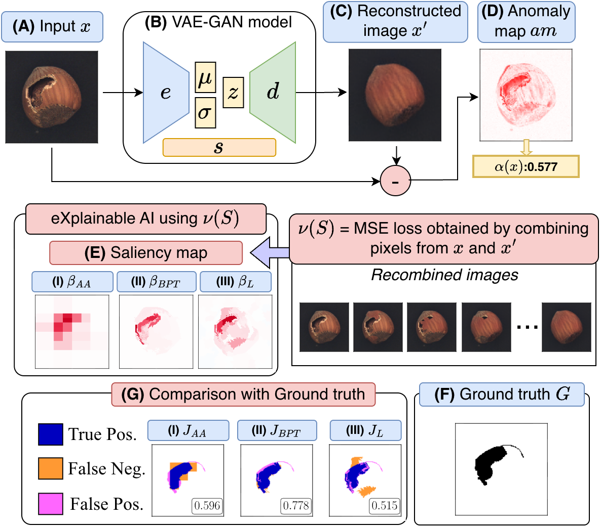

This talk presents **ShapBPT in Perspective**, a consolidated review and practical case study of **ShapBPT** for **eXplainable Anomaly Detection (XAD)**.

The work connects **hierarchical Shapley-based explanations** with real-world anomaly detection systems, showing how structured image feature attributions can support the interpretation of black-box anomaly detection models.

---

## 🔗 Resources

  <a href="https://dl.acm.org/doi/10.1145/3777911.3800638" class="custom-btn btn-paper">Paper</a>
  <a href="https://github.com/rashidrao-pk/XAD" class="custom-btn btn-code">Code</a>
  <a href="https://qualitawg.github.io/" class="custom-btn btn-demo">Workshop</a>
  <a href="https://icpe2026.spec.org/" class="custom-btn btn-demo">ICPE 2026</a>

---

## 📌 Talk Summary

- Presented ShapBPT as a data-aware hierarchical explanation method.
- Discussed its role in **Explainable Computer Vision**.
- Applied ShapBPT to **visual anomaly detection**.
- Showed how explanations can help interpret black-box anomaly detection systems.

---

## ⚙️ Method Overview

ShapBPT explains anomaly detection decisions by assigning attribution scores to image regions. Instead of using fixed geometric partitions, it relies on a **Binary Partition Tree (BPT)** to follow the intrinsic structure of the image.

---

## 🔍 Explainable Anomaly Detection Workflow

---

## 🖼️ Sample Output

---

## Keywords

ShapBPT · Explainable Anomaly Detection · XAI · Shapley Values · Binary Partition Trees · Computer Vision · ICPE 2026 · QualITA Workshop
