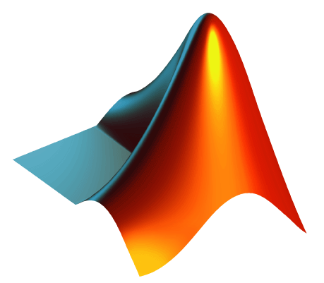

[🏠 Home](/README.md) | [📦 certifications](/certificates.md) | [🚀 Courses](/courses.md) | [📜 Projects Completed](/project_completed/README.md)

# RESEARCH PROJECTS (Completed as Freelancer) 🏭 :
I have completed various ***Computer Vision*** and ***Machine Learning*** projects on different freelance plateform.
Some of my contributions are publicaly available as open source on [***Mathworks website***](https://ch.mathworks.com/matlabcentral/fileexchange/113080-classification-of-gastrointestinal-diseases-of-stomach?s_tid=prof_contriblnk). Below is the breif summary of completed projects so far.

| Date | Title | Development Platform	 | Client	 | Client Location |
| :--: | ----- | :-------------------: | :-----: | :-------------: |
July   2022 | [PSO-implementation-and-Ensemble-Learning-Models-to-predict-Heart-Diseases](PSO-implementation-and-Ensemble-Learning-Models-to-predict-Heart-Diseases/README.md) | JUPYTER  PYTHON | FIVERR | UK | 
Jun 2022 | [Lungs Nodule Detection and Classification](Lungs_Nodule_Cancer_Detection_and_Classification_MRI_CT_Images/README.md) | MATLAB GUI | Fiverr | Pakistan |
May 2022 | [Polynomial Regression based on Deep Learning](Polynomial-Regression-based-on-Deep-Learning-in-Matlab/README.md) | MATLAB, PYTON | Upwork | UK |
May 2022 | [Image Matching using Point Features and Epiploar Lines](/Image-Matching-using-Point-Features-and-Epiploar-Lines-in-Matlab/README.md) | MATLAB, PYTON | Fiverr | US | 
Mar 2022 | [DOM Creation using Computer Vision and Machine Learning Approach](DOM-Creation-using-Computer-Vision-and-Machine-Learning-Approach/README.md) | MATLAB | Fiverr | Srilanka |
Feb  2022 | [Skin Lesion Detection, Segmentation, and Classification](Computer-Vision-based-system-in-Matlab-for-Benign-and-Malignant-Classification-Skin-Lesion-Detection/README.md) | MATLAB GUI | Fiverr | UK |
Feb  2022 | [Brain Tumor Detection and Identification](Brain-Tumor-Detection-and-Classification-GUI-based-App-in-Matlab/README.md) | MATLAB GUI | Fiverr | Malysia |
Dec 2021 | [Ant Movement Simulator using Genetic Algorithm based approach](/Ant-Movement-Simulator-using-Genetic-Algorithm-based-approach/README.md) | MATLAB | Fiverr | US |
Nov  2021 | [Fruit Classification for Automated Harvesting and Fruits Packing using Neural Networks](/Neural-Network-Based-Automatic-Fruit-Classification/README.md) | MATLAB GUI	| IIUI Student |	Islamabad, Pakistan |
Jun 2021 | [Image Fusion based on correlation](/Image-Fusion-based-on-correlation-in-MATLAB/README.md) </a>| MATLAB | Agriculture  University | Faisalabad, Pakistan |
Jun  2021 | [Bone Cancer Detection using MRI Images](Bone-Cancer-Detection-GUI-in-Matlab-using-Image-Processing-Techniques/README.md) | MATLAB GUI	| Fiverr | US |
Jun  2021 | [Driver drowsiness Detection based on Facial Features](Driver-Drowsiness-Detection-using-Computer-Vision-in-Matlab/README.md) | MATLAB GUI |	Fiverr |	Malysia |
Mar 2021 | [Image Denoising Using Contourlet-based Feature Pyramid](/Image-Denoising-Using-Contourlet-based-Feature-Pyramid/README.md) | MATLAB | Agriculture  University | Faisalabad, Pakistan |
Jun 2020 | [Skin Segmentation from Face Images using DLIB information](/Skin-Segmentation-from-Face-Images-using-DLIB-information-in-Matlab/README.md) | MATLAB | Fiverr | US |
Mar 2022 | [Image Stitching using SIFT features for Panorama Creation](Image-Matching-using-Point-Features-and-Epiploar-Lines-in-Matlab/README.md) | MATLAB | Fiverr | US |
May 2020 | [Patch-Based Image Enhancements](Patch-Based-Image-Enhancements-in-Matlab-CLAHE/README.md) | MATLAB | Fiverr | KSA |
May-2019 | [Low Light Image Enhancements](/Low-Light-Image-Enhancements-using-Matlab/README.md) </a>| MATLAB | Fiverr | China |
Mar 2019 | [Blood Vessels Extraction from Fundus Images](/Blood-Vessels-Extraction-from-Fundus-Images-in-Matlab/README.md) | MATLAB | Fiverr | UK |
Jan 2019 | [Document Classification Based on Deep Learning](/Document-Classification-Based-on-Deep-Learning-in-Matlab/README.md) | MATLAB | Comsats University | Wah, Pakistan |
Apr 2018 | [Person Re-Identification using Multiple Cams](Person-Re-Identification-using-Multiple-Cams-in-Matlab/README.md) | MATLAB | Comsats University | Wah, Pakistan |
Apr 2018 | [Heart-Vein-Blockage-Detection](Heart-Vein-Blockage-Detection/README.md) | MATLAB | AIOU| Islamabad, Pakistan |
-- -- | [Fake-News-Detection-using-Different-Machine-Learning-Classifiers](Fake-News-Detection-using-Different-Machine-Learning-Classifiers/README.md) | Python | -- | --, -- |
-- -- | [Implementation-of-Graph-Neural-Network-in-Python-on-MNIST-Dataset](Implementation-of-Graph-Neural-Network-in-Python-on-MNIST-Dataset/README.md) | Python | -- | --, -- |
-- -- | [Diabetic-Retinopathy-Diseases-Classification-using-Deep-Learning](/Diabetic-Retinopathy-Diseases-Classification-using-Deep-Learning/README.md) | Matlab | -- | --, -- |
-- -- | [Automatic Polyp Detection Semantic Segmentation Image Inpainting Specular Reflection Detection Stomach Disease Detection](/Automatic-Polyp-Detection-Semantic-Segmentation-Image-Inpainting-Specular-Reflection-Detection-Stom/README.md) | Matlab | -- | --, -- |
-- -- | [Region-based-active-contour-JSEG-fusion-technique-for-skin-lesion-segmentation-from-dermoscopic-imag](/Region-based-active-contour-JSEG-fusion-technique-for-skin-lesion-segmentation-from-dermoscopic-imag/README.md) | Matlab | -- | --, -- |

 

## CLIENT FEEDBACKS ⚡ :

I always preferred quality over the quantity and hence I always provided quality solutions resulting in satisfied clients. Here are few of examples what clients said about me? can be found at [`This Link`](/feedbacks.md)

# Profile Links 📧:

## a. Social Platforms :
|  Platform | Link  | count | 
| --------- | ----- | ----- | 
| LinkedIn  | [https://www.linkedin.com/in/rashid-rao-cuipakistan/](https://www.linkedin.com/in/rashid-rao-cuipakistan/)  | 
 

<!--   AI ON EDGE  -->

## b. Coding Platforms 💻:
|  Platform | Link  |
| --------- | ----- |
|  GitHub  | [https://github.com/rashidrao-pk](https://github.com/rashidrao-pk)  |
|  Kaggle  | [https://www.kaggle.com/rashidrao](https://www.kaggle.com/rashidrao)  |
| Mathworks | [https://www.mathworks.com/matlabcentral/profile/authors/14907465](https://www.mathworks.com/matlabcentral/profile/authors/14907465)

## c. Research Platforms 🌐:
|  Platform | Link  |
| --------- | ----- |
|  Google Scholar  | [https://scholar.google.com.pk/citations?user=F5u_Z5MAAAAJ](https://scholar.google.com.pk/citations?user=F5u_Z5MAAAAJ)  |
| Scopus  | [https://www.scopus.com/authid/detail.uri?authorId=57417085200](https://www.scopus.com/authid/detail.uri?authorId=57417085200)  |
| ResearchGate  | [https://www.researchgate.net/profile/Muhammad-Rashid-65](https://www.researchgate.net/profile/Muhammad-Rashid-65)  |
| SementicScholor  | [https://www.semanticscholar.org/author/Muhammad-Rashid/2293444837](https://www.semanticscholar.org/author/Muhammad-Rashid/2293444837)  |
| Web of Science  | [https://www.webofscience.com/wos/author/record/KSM-3480-2024](https://www.webofscience.com/wos/author/record/KSM-3480-2024)  |
| ORCID  | [https://orcid.org/0000-0002-2557-6845](https://orcid.org/0000-0002-2557-6845/)  |
| UnderLine  | [https://underline.io/speakers/254136-muhammad-rashid](https://underline.io/speakers/254136-muhammad-rashid)  |
| Sciprofiles  | [https://sciprofiles.com/profile/rashidmuhammad](https://sciprofiles.com/profile/rashidmuhammad)  |
| Loop Frontiersin  | [https://loop.frontiersin.org/people/2290013](https://loop.frontiersin.org/people/2290013)  |
| Cousera  | [https://www.coursera.org/learner/rashidrao-pk](https://www.coursera.org/learner/rashidrao-pk)  |

## d. Blog Posts 🌐:
|  Platform | Link  |
| --------- | ----- |
|  Medium  | [https://medium.com/@muhammad-rashid](https://medium.com/@muhammad-rashid)  |
|  Stackoverflow  | [https://stackoverflow.com/users/3309075/rashid-rao](https://stackoverflow.com/users/3309075/rashid-rao)  |
|  Nvidia  | [https://forums.developer.nvidia.com/u/rashid-rao/summary](https://forums.developer.nvidia.com/u/rashid-rao/summary)  |
|  ultralytics  | [https://community.ultralytics.com/u/mrashid/summary](https://community.ultralytics.com/u/mrashid/summary)  |

    
    &nbsp;&nbsp;&nbsp;&nbsp;&nbsp;&nbsp;
    
    &nbsp;&nbsp;&nbsp;&nbsp;&nbsp;&nbsp;
    <a href="https://www.mathworks.com/matlabcentral/profile/authors/14907465" target="_blank">
        
    &nbsp; | 
    
    &nbsp;&nbsp;&nbsp;&nbsp;&nbsp;&nbsp;
    
    &nbsp;&nbsp;&nbsp;&nbsp;&nbsp;&nbsp;
    
    &nbsp;&nbsp;&nbsp;&nbsp;&nbsp;&nbsp;
    
    &nbsp;&nbsp;&nbsp;&nbsp;&nbsp;&nbsp;
    
    &nbsp; |
    
    &nbsp;&nbsp;&nbsp;&nbsp;&nbsp;&nbsp;
    
    &nbsp;&nbsp;&nbsp;&nbsp;&nbsp;&nbsp;
    
    &nbsp;&nbsp;&nbsp;&nbsp;&nbsp;&nbsp;
    
    &nbsp;&nbsp;&nbsp;&nbsp;&nbsp;&nbsp;
    

  <a href="#" 
     style="
        display: inline-block; 
        padding: 5px 10px; 
        background-color: #469B60; 
        color: white; 
        text-decoration: none; 
        border-radius: 5px; 
        font-weight: bold; 
        font-size: 14px; 
        box-shadow: 2px 2px 5px rgba(0, 0, 0, 0.2);">
    Go to TOP
  </a>

